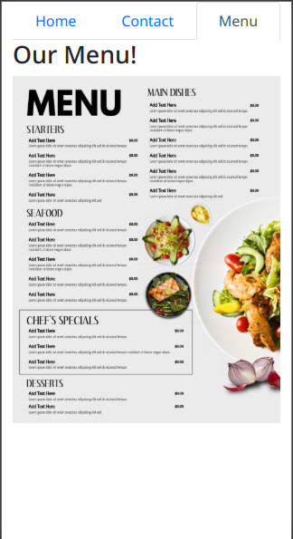

# Restaurant Page

This is a simple restaurant page built for study purposes.

## Restaurant Directory 📙

| Contents                    |
| --------------------------- |
| [Built With](#built-with-🛠) |
| [Install](#install-⏳)      |
| [Testing](#testing-⚙️)      |
| [Authors](#authors)         |
| [License](#license)         |

## Description

> Dynamic, tabbed, responsive and modular restaurant page.

## Built With 🛠

- JavaScript
- Bootstrap 5

## Live Demo

<button> <a href="https://meronokbay.github.io/restaurant-page/"> Click here!</a> </button>

## Install ⏳

> Follow these steps below to get out Application working

1. - [ ] Open your `Terminal`
2. - [ ] Navigate to the directory where you would like to install the repo by running `cd FOLDER-NAME`
3. - [ ] Run `git clone git@github.com:meronokbay/restaurant-page.git` to download <b>or</b> you can download using `HTTPS` by running `git clone https://github.com/meronokbay/restaurant-page` in the terminal

## Testing ⚙️

1. - [ ] Run `npm i` to install
2. - [ ] Run `npx eslint .`
3. - [ ] Run `npx stylelint "**/*.{css,scss}"`

## Author

### 👨‍💻 Meron Ogbai

  
  
  

### 🤝 Contributing

Contributions, issues and feature requests are welcome!

Feel free to check the [issues page](https://github.com/meronokbay/restaurant-page/issues).

### Show your support

Give a ⭐️ if you like this project!

### License

